<!-- ============================================= HEADER ============================================= -->

  

  

<!-- ============================================= ABOUT ============================================= -->

## 🚀 About Me

Senior Software Engineer at **Pine Labs**, building payment & commerce products across **Banking, Airlines, Travel & E-Commerce** from Bengaluru, India.

- 🏗️ Architected a backend serving **50K+ daily active users** at **99.9% uptime**
- 💳 Built a gift card platform processing **10K+ transactions/day** and a B2B platform serving **50+ corporate clients**
- 🔐 Designed an **RBAC Admin Panel** that cut admin task time by **30%**
- 👥 Led a team of **5 engineers**, mentored juniors, **100+ code reviews** — dev velocity up **20%**, prod bugs down **25%**
- 🌱 Currently going deep on **System Design (HLD/LLD)**, **JavaScript & React internals**, and **DSA**

<!-- ============================================= FEATURED PROJECTS ============================================= -->

## 💼 Featured Projects

| Project | What it is | Built with |
| :--- | :--- | :--- |
| [**Social Media App**](https://github.com/Sagar-Gondage/next-15-social-media-app) | Full-stack social platform — feeds, follows, likes & comments | Next.js 15, React, MongoDB |
| [**YouTube Clone**](https://github.com/Sagar-Gondage/clone-youtube) | Video platform with search, playback & channel pages | Next.js, TypeScript |
| [**E-Commerce App**](https://github.com/Sagar-Gondage/e-commerse-app) | Marketplace with cart, checkout & full admin CRUD | React, Node.js, Express, MongoDB |
| [**Razorpay Integration**](https://github.com/Sagar-Gondage/razorpay-payment-integration) | End-to-end payment gateway integration | Node.js, Razorpay API |

<!-- ============================================= TECH STACK ============================================= -->

## 🛠️ Tech Stack

**🎨 Frontend**

**⚙️ Backend & Database**

**🧰 Tools & Platforms**

<!-- ============================================= GITHUB ANALYTICS ============================================= -->

## 📊 GitHub Analytics

  

  

<!-- ============================================= SNAKE ============================================= -->

  <picture>
    <source media="(prefers-color-scheme: dark)" srcset="https://raw.githubusercontent.com/Sagar-Gondage/Sagar-Gondage/output/github-snake-dark.svg" />
    <source media="(prefers-color-scheme: light)" srcset="https://raw.githubusercontent.com/Sagar-Gondage/Sagar-Gondage/output/github-snake.svg" />
    
  </picture>

<!-- ============================================= CONNECT ============================================= -->

## 🤝 Let's Connect

  
  
  
  

  <i>"First, solve the problem. Then, write the code." — John Johnson</i>

<!-- ============================================= FOOTER ============================================= -->

  

